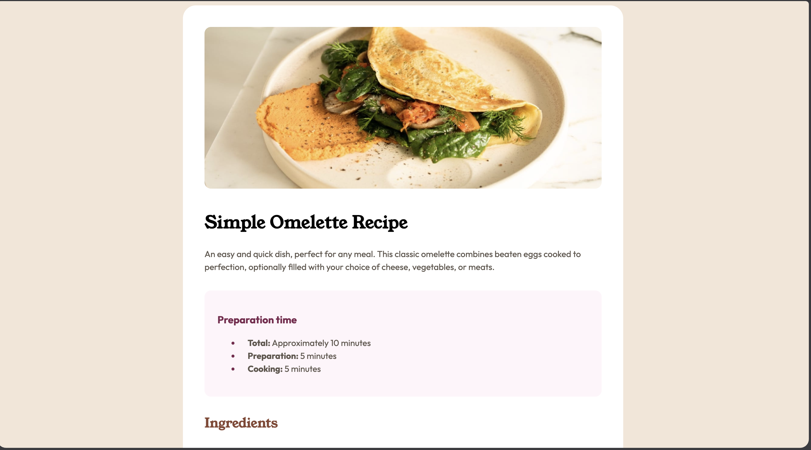
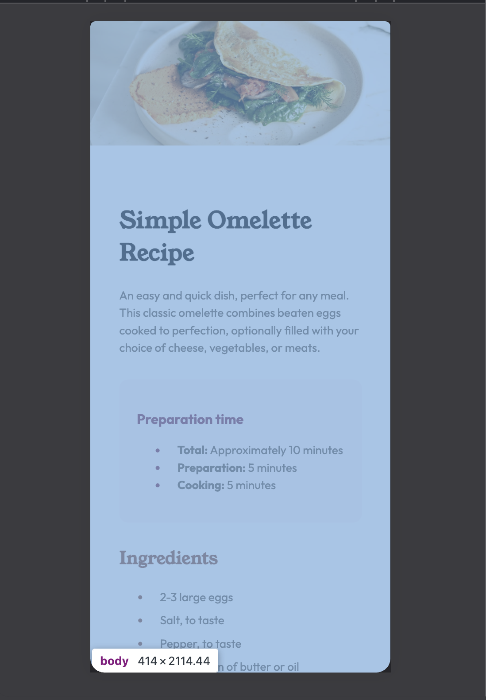

# Frontend Mentor - Recipe page solution

This is a solution to the [Recipe page challenge on Frontend Mentor](https://www.frontendmentor.io/challenges/recipe-page-KiTsR8QQKm). Frontend Mentor challenges help you improve your coding skills by building realistic projects. 

## Table of contents

- [Overview](#overview)
  - [The challenge](#the-challenge)
  - [Screenshot](#screenshot)
  - [Links](#links)
- [My process](#my-process)
  - [Built with](#built-with)
  - [What I learned](#what-i-learned)
  - [Continued development](#continued-development)
  - [Useful resources](#useful-resources)
  - [AI Collaboration](#ai-collaboration)
- [Author](#author)


**Note: Delete this note and update the table of contents based on what sections you keep.**

## Overview

### Screenshot





### Links

- Solution URL: [Add solution URL here](https://your-solution-url.com)
- Live Site URL: [Add live site URL here](https://your-live-site-url.com)

## My process

### Built with


- CSS custom properties
- Flexbox
- Mobile-first workflow


### What I learned


I learned about the border collapse property in table rows that made the borders of table cell content touch each other(using AI as a handy guide). 

I also learned how to style list items using css. for example:
```
.prep-time-list li::marker {
    color: hsl(332, 51%, 32%);
}
```

### Continued development

I would like to refine how perfect my code structure so that it's very much more understandable and intuitive even though it works.

### Useful resources

- [DSeek Chat](https://chat.deepseek.com) - Using the chat feature via OpenCode to debug my code

### AI Collaboration


I used OpenCode extensively and the model harnessed was Deepseek V4 Flash. I used it because it's tokens are dead cheap and using it within OpenCode made the entire context of this project available to model. 

## Author

- Website - [My Github](https://github.com/4lphav01d)
- Frontend Mentor - [@4lphav01d](https://www.frontendmentor.io/profile/4lphav01d)

